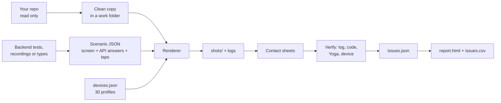

# render-harness

An agent skill that renders your app's **real frontend code** with **real backend data** on **many devices at once**,
then turns the screenshots into side-by-side contact sheets, verified findings and an HTML/CSV report.

You say something like *"show me the checkout flow on all phones and the Duo, in Arabic too"*. The agent builds a
throwaway harness around your repo, answers every API call from scenario files, screenshots every state on every device
profile, checks each suspected bug against the code, and hands you a report grouped by root cause. No simulator, no
device lab, and nothing in your repo is edited.

It works with any frontend: web apps (Next.js, React, Vue, Nuxt, Angular, Svelte, Remix, Ionic), React Native, Flutter,
native iOS (SwiftUI, UIKit) and native Android (Compose, Views).

## Contents
- [What you get](#what-you-get)
- [How it works](#how-it-works)
- [Supported stacks](#supported-stacks)
- [Devices](#devices)
- [Accuracy](#accuracy)
- [Requirements](#requirements)
- [Install](#install)
- [Using it](#using-it)
- [Using the scripts without an agent](#using-the-scripts-without-an-agent)
- [Scenario format](#scenario-format)
- [What the run log flags](#what-the-run-log-flags)
- [React Native in the browser](#react-native-in-the-browser)
- [Flutter, native iOS and native Android](#flutter-native-ios-and-native-android)
- [Where the data comes from](#where-the-data-comes-from)
- [Review and report](#review-and-report)
- [Rules the skill follows](#rules-the-skill-follows)
- [Repository layout](#repository-layout)
- [Testing and improving the skill](#testing-and-improving-the-skill)
- [Adding a device](#adding-a-device)
- [Troubleshooting](#troubleshooting)

## What you get
- **Screenshots of every state on every device**: `shots/<device>/<flow>__<state>[__ar][__dark]-01.png`, plus scrolled
  pages (`-02`, `-03`) and step shots after taps, typing or a fold/unfold.
- **Contact sheets**: one image per state with one column per device, so layout problems jump out across sizes.
  Fold flows get sequence sheets (cover, then unfolded, then folded back).
- **A log per render** that flags what screenshots hide: API calls with no mock, page errors, pages wider than the
  screen (and which element causes it), taps on controls a real user could not reach, page zoom carried across a fold.
- **Verified findings**: every suspected bug is traced to code (`file:line`) before it is reported, and React Native
  layout claims are checked against Yoga, the engine phones use.
- **A report**: `report.html` (priority and per-flow views, severity and language filters, thumbnails) and `issues.csv`
  (one row per affected screen, ready for a spreadsheet). Findings are deduplicated by root cause: one issue per fix,
  with every affected screen listed.

## How it works



1. **Scope**: which flows, devices, languages, light or dark.
2. **Bootstrap** a work folder (`scripts/bootstrap.sh`): a small runner with Playwright driving your installed Chrome.
3. **Detect the stack** and follow the matching guide in `references/`.
4. **Get real data**: dump responses from the backend's own tests, record from a test environment, or build from the
   frontend's types (marked as hand-built). Never invented JSON.
5. **Write scenarios**: one JSON file per state (which screen or URL, every API response, the taps to perform).
6. **Shoot**: `scripts/shoot.mjs` renders every scenario on every requested device, intercepting every API call.
7. **Review**: contact sheets first, then each finding climbs a verification ladder (log, code, layout engine, device).
8. **Report**: dedupe into root causes and generate the HTML and CSV report.

The key idea: one scenario format and one output layout for every stack, so the sheets, review and report steps are
the same whether the screenshots came from Chrome, a Flutter golden test, an iOS snapshot test or an emulator.

## Supported stacks

| Your app | How it is rendered | Guide |
|---|---|---|
| Web: Next.js, React (Vite, CRA), Vue, Nuxt, Angular, SvelteKit, Remix, Solid, Ember, Blazor WASM | Your dev server in headless Chrome at each device's browser size; API calls answered from the scenario (plus a mock server for server-side fetches) | `references/web.md` |
| Ionic, Capacitor, Cordova, PWAs, Electron renderers, webviews | Same, with `--standalone` (full screen, system UI drawn) | `references/web.md` |
| React Native, Expo | Your real screens through react-native-web, using the template in `assets/rn-web/` (webpack config, shims for native modules, navigation, safe areas, a react-native-web patch for RN layout, a Yoga checker) | `references/react-native.md` |
| Flutter | A Flutter web build in Chrome, or golden tests with the same device matrix | `references/flutter.md` |
| Native iOS (SwiftUI, UIKit) | swift-snapshot-testing with a URLProtocol stub fed by the scenarios, or the real app on the Simulator against the mock server | `references/native-ios.md` |
| Native Android (Compose, Views) | Paparazzi or Roborazzi with a MockWebServer dispatcher, or the real app on the emulator against the mock server | `references/native-android.md` |

The browser path (web, React Native, Flutter web) is fully scripted and tested on real apps. The native and Flutter
golden paths are documented recipes with code snippets and the device matrix exported as code
(`scripts/devices_export.py`); they have not yet been exercised end to end on a production app.

## Devices
30 profiles in `scripts/devices.json`, in CSS points (what layouts see), with scale, platform, safe-area insets, system
UI to draw, fold crease, dead tap zones, the visible browser height, an `approx` marker for anything not measured, and a
`source` note.

| Group | Profile id | Screen (points) | Covers |
|---|---|---|---|
| iPhone | `iphone-se` | 375 x 667 | SE 2nd and 3rd gen |
| | `iphone-13-mini` | 375 x 812 | 12 mini, 13 mini |
| | `iphone-14` | 390 x 844 | 12, 13, 14, 16e, 17e |
| | `iphone-15` | 393 x 852 | 14 Pro, 15, 15 Pro, 16 |
| | `iphone-17` | 402 x 874 | 16 Pro, 17, 17 Pro, 18 Pro |
| | `iphone-air` | 420 x 912 | iPhone Air |
| | `iphone-15-pro-max` | 430 x 932 | 14 Pro Max, 15 Plus, 15 Pro Max, 16 Plus |
| | `iphone-17-pro-max` | 440 x 956 | 16 Pro Max, 17 Pro Max, 18 Pro Max |
| Android | `android-small` | 360 x 800 | small Android phones |
| | `galaxy-s24` | 360 x 780 | Galaxy S24, S25 |
| | `galaxy-s24-ultra` | 384 x 832 | S24+, S24 Ultra, S25+, S25 Ultra, A55, A15, A16 |
| | `pixel-7` | 412 x 915 | Pixel 7 |
| | `pixel-9` | 412 x 924 | Pixel 9 |
| | `pixel-9-pro-xl` | 448 x 998 | Pixel 9 Pro XL |
| Foldables | `galaxy-fold-cover`, `galaxy-fold-open` | 344 x 882, 690 x 829 | Galaxy Z Fold5 |
| | `duo-cover` | 466 x 678 | iPhone Duo cover screen |
| | `duo-open-l`, `duo-open-p` | 951 x 669, 669 x 951 | iPhone Duo open, landscape and portrait |
| | `duo-split-l`, `duo-split-p` | 475 x 669, 669 x 475 | iPhone Duo Split View panes |
| Tablet | `ipad-mini` | 744 x 1133 | iPad mini portrait |
| Desktop | `desktop-1366`, `desktop-1536`, `desktop-1920`, `desktop-2560` | 1366 x 768 to 2560 x 1440 | common Windows laptops and monitors (1536 x 864 is 1920 x 1080 at 125%) |
| | `desktop-1440`, `macbook-air-13`, `macbook-pro-14`, `macbook-pro-16` | 1440 x 900 to 1728 x 1117 | older MacBook Air and Mac monitors, current MacBooks |

- **Model names work too.** Phones that share a screen are aliases: `--devices=iphone-16e` renders the `iphone-14`
  profile, `galaxy-s25-ultra` renders `galaxy-s24-ultra`. Each screen is rendered once.
- **Sets**: `phones` (the default matrix: SE, 15, 17 Pro Max, Galaxy S24, S24 Ultra, Pixel 9), `ios`, `android`,
  `samsung`, `foldables`, `duo`, `tablets`, `desktop`, `mac`, `mobile` (all phones, foldables and tablets), `all`.
- **Phones and tablets** browse as mobile Safari or Chrome with touch. **Desktop profiles** browse as desktop Chrome with
  a mouse (no touch, desktop user agent), so sites serve their desktop layout.
- **Web mode** uses each device's visible browser page (width and height) and draws no system UI. On the iPhone Duo
  cover Safari keeps its controls in the 84 pt side column, so pages get 382 x 580 of the 466 x 678 screen.
  **React Native mode and `--standalone`** use the full screen and draw the status bar, Dynamic Island or notch, home
  indicator (iPhones only: the Duo has none), Android bars, and the Duo's status capsule or cluster on top. `--guides` overlays safe areas, the crease and dead tap zones.
- **Foldables**: a `{"device": "duo-open-l"}` step resizes mid-flow like unfolding, so you can see whether state and
  layout survive a fold.

## Accuracy
| What | How it was determined | Confidence |
|---|---|---|
| iPhone screen sizes | Read from Apple's simulator device profiles shipped with Xcode | Exact |
| iPhone safe areas | Published simulator measurements; models with identical display hardware share values | High |
| iPhone Duo safe areas and Safari page | Measured on the Xcode 27.1 simulator with a probe app: cover and open landscape both top 0, bottom 34, right 84 (the side column), no home indicator; Safari page 382 x 580 on the cover, 951 x 589 open | Exact for cover and open landscape; open portrait and Split View panes estimated |
| Galaxy and Pixel sizes and pixel ratio | Each phone's own firmware density at default settings, cross-checked with real-traffic viewport data. Chrome DevTools' and Playwright's built-in presets are wrong for the Galaxy A55 and Pixel 9, so they are not used | High (S26 and S26+ inferred from the S24/S25 pattern) |
| Samsung status and navigation bar heights | Not published; derived from one measured Galaxy Ultra page height | Approximate |
| Visible browser heights | Measured where possible (iPhone Duo cover and open landscape; MacBook Pro 14: Chrome's tab strip and toolbar are 87 points); derived elsewhere | Approximate, varies with toolbars, Dock, taskbar, zoom |
| Desktop widths | Standard screen sizes | Exact (width is what selects a site's layout) |
| Galaxy Fold | Estimated | Approximate |

Every profile with an estimated value carries `approx` (`web.h`, `insets` or `all`), and the HTML report lists
approximate profiles automatically.

What a render can and cannot show:
- **Real**: your code, components, styles, strings, fonts, themes, state management and the data you feed it.
- **Close**: web apps render in Chrome, so Safari can differ slightly. React Native renders through react-native-web,
  so text wrapping and truncation can differ from the phone; the skill confirms those with Yoga before calling them
  bugs.
- **Not reproduced**: maps, camera and video (labelled placeholders), animations (you see one frame), real keyboards,
  system sheets and alerts, and OS behaviour such as touches swallowed by system UI (known dead zones like the Duo
  capsule are flagged).

Renders find most layout, data and copy problems quickly. Confirm the top issues on a simulator or real device; the
skill labels those NEEDS DEVICE.

## Requirements
- **Node.js 18 or newer** and **Google Chrome** (or Chromium; set `CHROME_PATH` if it is not in a standard place). The
  runner installs `playwright-core` only, no browser download.
- **Python 3** with Pillow for contact sheets and annotations. With [uv](https://docs.astral.sh/uv/) nothing needs
  installing: `uv run --quiet --with pillow python scripts/contact_sheet.py ...`. `report.py` needs only the
  standard library.
- **Your app's own toolchain** to run it (its package manager, and for React Native the packages listed in
  `references/react-native.md`). The skill installs into a clean copy, never into your checkout.
- **For native paths**: Xcode with a Simulator runtime (iOS) or Android Studio with an emulator or Gradle (Android).
- macOS and Linux are tested. On Windows use WSL.

## Install
A skill is a folder with a `SKILL.md`. Install by putting this repository's folder where your agent looks for skills,
named `render-harness`. Clone once and symlink if you use several agents.

### Claude Code
Personal (every project on your machine):
```bash
git clone https://github.com/Ahmed-Badr00/render-harness ~/.claude/skills/render-harness
```
Project (shared with everyone who works in a repo; commit it):
```bash
git clone https://github.com/Ahmed-Badr00/render-harness .claude/skills/render-harness
# or: git submodule add https://github.com/Ahmed-Badr00/render-harness .claude/skills/render-harness
```
From a ZIP (GitHub "Download ZIP" or a packaged `render-harness.skill`, which is a zip): unzip so the path is
`~/.claude/skills/render-harness/SKILL.md`. GitHub's ZIP unpacks to `render-harness-<branch>/`, so rename the folder.

Start a new Claude Code session. The skill loads by itself when you ask to render, test or compare screens across
devices; you can also name it ("use render-harness to ..."). Update with `git -C ~/.claude/skills/render-harness pull`.

### Claude Agent SDK
Put the folder in the project's `.claude/skills/` (or `~/.claude/skills/`), load filesystem settings (`settingSources`
with `"project"` and/or `"user"`) and allow the `Skill` tool, plus `Bash`, `Read` and `Write`, which the skill needs.

### Claude.ai and the Claude desktop app
Settings, Capabilities, Skills, upload a ZIP whose top folder is `render-harness` (code execution must be on). Note:
there the skill runs in a cloud sandbox that cannot see your local repos, your Chrome or your dev servers, so it is
only useful for reading the method. Use Claude Code (or another local agent) to actually render.

### Codex CLI
```bash
git clone https://github.com/Ahmed-Badr00/render-harness ~/.codex/skills/render-harness
# or the cross-agent folder Codex also reads: ~/.agents/skills/render-harness (or <repo>/.agents/skills/)
```

### Gemini CLI
`~/.gemini/skills/render-harness` (personal) or `.gemini/skills/render-harness` / `.agents/skills/render-harness`
(workspace). See [Gemini CLI skills](https://geminicli.com/docs/cli/skills/).

### Cursor
`~/.cursor/skills/render-harness` or `.cursor/skills/render-harness`. Cursor also reads `~/.claude/skills` and
`.agents/skills`. See [Cursor skills](https://cursor.com/docs/skills).

### GitHub Copilot
`.github/skills/render-harness` in a repository, or `~/.copilot/skills/render-harness`. Copilot also reads
`.claude/skills` and `.agents/skills`. See
[Copilot skills](https://docs.github.com/en/copilot/how-tos/use-copilot-agents/cloud-agent/create-skills).

### One clone for every agent
```bash
git clone https://github.com/Ahmed-Badr00/render-harness ~/skills/render-harness
for d in ~/.claude/skills ~/.agents/skills ~/.codex/skills ~/.gemini/skills ~/.cursor/skills ~/.copilot/skills; do
  mkdir -p "$d" && ln -sfn ~/skills/render-harness "$d/render-harness"
done
```

### Any other agent
If your tool has no skill system but can read files and run shell commands, add a line to its instructions file
(`AGENTS.md`, `GEMINI.md`, `.cursorrules`, a system prompt): *"For rendering, testing or comparing UI across devices,
read and follow `<path>/render-harness/SKILL.md`."*

The agent needs permission to run shell commands (Node, Python, git, your app's dev server) and to write to a work
folder outside your repo (default `~/render-harness/<app>-<date>/`).

## Using it
Ask in plain words. Examples:
- "Render the order details page of this repo on phones and foldables, English and Arabic, and tell me what breaks."
- "How does the cart look on a Galaxy S24, iPhone SE and a 1920 desktop with a 30 character product name?"
- "We are adding Duo support: test every checkout state on the Duo cover, open and Split View, including fold and
  unfold, and give me a report sorted by priority."
- "Compare the profile screen before and after my branch on all iPhones."
- "Show the empty, loading and error states of the search page on the smallest and largest phones, dark mode."

What the agent does: reads your repo to find the stack, screens and API calls; asks only what it cannot infer (for
example which flows); builds the work folder; finds or builds realistic data; renders; reviews; reports. It tells you
which data is real and which is hand-built, and lists anything it could not test.

## Using the scripts without an agent
```bash
SKILL=~/.claude/skills/render-harness
WORK=~/render-harness/myapp-20261003
bash $SKILL/scripts/bootstrap.sh $WORK          # runner/, scenarios/, shots/, sheets/, findings/ (add --rn for the Yoga checker)

# 1. start your app (a clean copy is best): e.g. npm run dev on :3000
# 2. write a scenario: $WORK/scenarios/orders/list.json (format below)
cd $WORK
node runner/shoot.mjs orders --base=http://localhost:3000 --devices=phones,duo --out=shots
node runner/shoot.mjs orders --base=http://localhost:3000 --devices=phones --lang=ar
node runner/shoot.mjs orders --base=http://localhost:3000 --devices=phones --color-scheme=dark

uv run --quiet --with pillow python $SKILL/scripts/contact_sheet.py --shots shots --devices phones,duo --out sheets/orders --only orders__
python3 $SKILL/scripts/report.py findings/issues.json --out report      # after writing findings/issues.json
```
Pass a scenario folder name (`orders`), not `orders/*`: zsh expands the glob against the wrong folder.

### shoot.mjs options
| Option | What it does |
|---|---|
| `--base=URL` | the app (web) or react-native-web harness (rn) URL |
| `--devices=ids,sets` | profiles, sets or model aliases |
| `--scenarios=DIR`, `--out=DIR` | scenario root (default `./scenarios`) and output folder (default `./shots`) |
| `--lang=ar`, `--locale`, `--dir=rtl` | language hints; React Native reads them, web apps decide RTL themselves |
| `--color-scheme=dark` | `prefers-color-scheme` (React Native reads it too) |
| `--now=ISO`, `--tz=Asia/Dubai` | freeze the browser clock so relative dates match the data |
| `--standalone` | full screen with system UI drawn (PWAs with `viewport-fit=cover`, webviews) |
| `--mock-server=URL` | also load each scenario's routes into `mock_server.mjs`, for data fetched on the server (Next.js server components, `getServerSideProps`, Remix loaders) |
| `--no-pages`, `--max-pages=8`, `--scale=N` | scrolled pages and PNG size |
| `--workers=2` | parallel renders (keep total Chrome workers around 3 to 4 per laptop) |
| `--guides`, `--no-chrome` | draw safe areas, crease and dead tap zones; or skip drawing system UI |
| `--block=REGEX`, `--passthrough=REGEX`, `--unmatched=404\|passthrough` | request policy (block analytics, let some calls through) |
| `--strict-reach` | stop at a tap a user could not make, instead of logging it and continuing |
| `--dump`, `--eval=EXPR` | print each render's visible text, errors, requests and an expression's value (debug a blank or wrong screen) |
| `--mode=web\|rn`, `--root=#root`, `--headed`, `--chrome-path` | advanced |

## Scenario format
One file per state. Real files are plain JSON; the comments here are explanations.
```jsonc
{
  "url": "/orders",                                   // web: path under --base
  "screen": "OrderDetails", "props": { "id": "X1" },  // React Native instead of url ("stack" for several screens)
  "routes": [                                         // every API answer for this state; first match wins
    { "method": "GET", "path": "/v1/orders", "host": "api.example.com", "queryRegex": "page=1", "file": "data/orders.json" },
    { "method": "GET", "pathRegex": "^/v1/orders/[^/]+$", "data": { "status": "shipped" } },
    { "method": "POST", "path": "/v1/orders/X1/cancel", "status": 400, "data": { "error": "Already shipped" }, "times": 1 },
    { "method": "GET", "path": "/v1/profile", "file": "data/{lang}/profile.json" },   // per-language data from --lang
    { "method": "GET", "path": "/v1/feed", "hold": true },                           // never answers: loading states
    { "method": "GET", "path": "/v1/recs", "networkError": true },                   // offline
    { "method": "*", "urlRegex": "^https://cdn\\.example\\.com/config", "delayMs": 3000, "body": "{}" }
  ],
  "includeRoutes": ["orders/shared-routes"],          // shared answers (auth, config) from another file
  "storage": { "localStorage": {}, "sessionStorage": {}, "cookies": [{ "name": "session", "value": "fake" }] },
  "readyWhen": { "text": "Your orders" },             // or {selector}, {fn}, {networkIdle: false}
  "boxes": ["[data-testid=more]"],                    // record element boxes for evidence annotations
  "steps": [
    { "click": "Cancel order", "wait": 800, "shot": "cancel-error" },
    { "clickSelector": "[data-testid=more]" }, { "type": "hello", "selector": "textarea" }, { "press": "Enter" },
    { "scroll": { "by": 600 } }, { "waitFor": { "text": "Done" } },
    { "device": "duo-open-l", "shot": "after-unfold", "pages": false }              // fold or unfold mid-flow
  ],
  "devices": ["phones"]
}
```
Unmatched API calls get a 404 and are listed as `api-miss`; framework internals (Next.js, Vite, webpack HMR) always
pass through. The full reference is in `SKILL.md`.

## What the run log flags
Each result line and `.log.json` reports:
- `api-miss=...`: a call the scenario does not answer. Usually the cause of a blank screen or endless spinner.
- `errors=N`: page errors, app errors and failed steps.
- `overflow=+Npx`: the page is wider than the device, with the elements that stick out and their CSS width or
  min-width. The most common problem of desktop layouts on phones.
- `unreachable=...`: a tap on a control a real user could not reach (clipped by an `overflow: hidden` box, off screen,
  covered by another element, a tap that falls through to something that ignores it, or under a dead tap zone like the
  Duo cover's status capsule). The harness still taps it so the flow continues, and marks the following shots as
  harness-only.
- `zoom-carried=`: Chrome kept the page zoom across a fold step; the harness resets it and logs the value.
- `NOTE: the skill changed since bootstrap`: re-run `bootstrap.sh` on the work folder.

## React Native in the browser
React Native screens render through react-native-web inside a small webpack app built from `assets/rn-web/`:
- **Aliases and shims** replace native-only modules: device info, safe areas (live on fold), async storage and
  preferences (seeded from the scenario), navigation (react-native-navigation and react-navigation, with a live in-page
  stack so pushes and modals render), fast-image, gesture handler, Sentry, codegen components, and visible placeholders
  for maps, video, webview, lottie and blur. Anything else that crashes is stubbed and listed as untested.
- **Layout fidelity**: a react-native-web patch for RN's RTL swap, `flex: 0` and `direction`; a Yoga clamp so text wraps
  and truncates like the phone; emulation of `adjustsFontSizeToFit`; SVG icons that do not shrink.
- **Your real boot**: `providers.js` reproduces your app's provider tree and startup (store with real reducers, themes,
  i18n, feature flags, static singletons) and `registry.js` maps screen names to your real components.
- **Ground truth**: `bin/yoga_check.mjs` lays out a style tree with Yoga and your font files, to confirm wrap,
  overflow and truncation findings.

Expect 30 to 90 minutes for the first boot of a large app (mostly stubbing native modules), then minutes per scenario.

## Flutter, native iOS and native Android
- `scripts/devices_export.py --devices phones,duo --format swift|kotlin|flutter|simctl|json` prints the same device
  matrix as code: swift-snapshot-testing `ViewImageConfig`s, Paparazzi `DeviceConfig`s, a Dart map for golden tests,
  or the Simulator types to create.
- `scripts/use_scenario.mjs <scenario> --print` prints a scenario's resolved routes as JSON for an in-test stub
  (URLProtocol, MockWebServer dispatcher, a fake repository), or loads them into `mock_server.mjs` for a real app on a
  Simulator or emulator.
- Screenshots are copied into the shared `shots/<device>/...` layout, so contact sheets and the report work unchanged.

## Where the data comes from
A screenshot is only as true as its data. The skill climbs a ladder per endpoint:
1. **Dump from the backend's own tests**: call the real endpoint with the suite's client and fixtures, save the JSON.
2. **Record** from a dev or staging environment with a test account (you sign in yourself; it scrubs personal data).
3. **Edit a real response** for states no source can produce, checking every field against the models.
4. **Build from the frontend's types and the repo's own fixtures** when no backend is reachable, marked hand-built.

It never types JSON from imagination, never uses real customer data or credentials, and warns you if a repo's own mock
files contain real-looking personal data or keys.

## Review and report
- **Verification ladder** before anything is reported: (1) the log is clean, (2) the code path is found (`file:line`),
  (3) React Native layout claims are confirmed with Yoga, (4) anything depending on OS behaviour is NEEDS DEVICE.
- **Dedupe by root cause**: a back button, a close icon and a chip hidden by the same status bar are one issue with
  three affected screens, because they share one fix.
- **issues.json** (schema in `assets/issues.example.json`) feeds `scripts/report.py`, which writes `report.html` and
  `issues.csv`. Evidence images are annotated with `scripts/annotate.py` (boxes from coordinates or from recorded
  element selectors).
- For big audits, one agent per flow with `assets/agent-brief.md`, and optionally a second model's read-only review to
  filter false positives.

## Rules the skill follows
- Never edits your app code or your checkout; works in a clean copy (`git archive`) and records the commit rendered.
- Test and fixture data only; never real credentials.
- Never kills processes by name pattern; stops only the servers it started (by PID).
- Treats renders of unreleased screens as private: asks before uploading or publishing anything.
- No em or en dashes in deliverables (house style; `report.py` refuses them).

## Repository layout
```
SKILL.md                 the skill: workflow, scenario format, devices, rules (what the agent reads first)
references/              one guide per stack plus data and review guides (read on demand)
  web.md  react-native.md  flutter.md  native-ios.md  native-android.md  backend-data.md  review-and-report.md
scripts/
  bootstrap.sh           work folder + runner (playwright-core, system Chrome); --rn adds the Yoga checker
  shoot.mjs              the browser renderer: device profiles, route interception, steps, logs, reach and overflow checks
  routes.mjs             route matching shared with the mock server
  mock_server.mjs        HTTP backend answering from the current scenario (server-side fetches, simulators, emulators)
  use_scenario.mjs       load a scenario into the mock server, or print its resolved routes
  devices.json           the 30 profiles, aliases and sets
  devices_export.py      profiles as Swift, Kotlin, Dart or Simulator settings
  contact_sheet.py       side-by-side sheets (and --sequence for fold flows)
  annotate.py            red boxes and labels for evidence screenshots
  report.py              issues.json to report.html + issues.csv
assets/
  rn-web/                react-native-web harness template (webpack config, boot, navigation, shims, patches, Yoga checker)
  scenario.web.example.json  scenario.rn.example.json  issues.example.json  agent-brief.md
evals/evals.json         test prompts and checks for improving the skill
```

## Testing and improving the skill
`evals/evals.json` holds realistic prompts (a React Native screen matrix and a web app mobile check) with checks such
as "checkout untouched", "every requested device rendered", "no API misses", "findings cite code". Run them with an
agent that has the skill (for example with Anthropic's skill-creator workflow), grade the outputs, and fold what the
runs struggled with back into the scripts and guides. Each run is asked to write a `NOTES.md` of where the skill was
wrong or missing; most of the current features came from those notes.

## Adding a device
Measure it, do not guess: screen size in points (simulator device profile, emulator config, or a test page reporting
`screen.width`, `innerHeight` and `devicePixelRatio`), scale, safe-area insets, where the system UI sits and whether it
swallows taps. Add an entry to `scripts/devices.json` with a `source`, mark unmeasured values in `approx`, add model
names that share the screen to `aliases`, and add it to the relevant sets.

## Troubleshooting
| Symptom | Likely cause |
|---|---|
| Blank screen or endless spinner | an `api-miss` in the log, or a missing prop; run with `--dump` |
| Page shows data but the log has no requests | data fetched on the server: use `mock_server.mjs` and `--mock-server` |
| Redirect to login | auth checked on the server or a missing session route |
| `no matches found` in zsh | pass `orders`, not `orders/*` |
| Loading state cannot be captured | use a `"hold": true` route |
| React Native: `Element type is invalid ... got: undefined` | a stubbed package's factory returned undefined; give it a shim (see `references/react-native.md`) |
| React Native: everything left to right in Arabic | the react-native-web patch is missing |
| Port already in use | `restart_server.sh` names a free port; it never stops a server it did not start |
